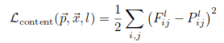
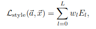
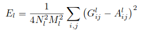
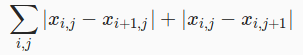

# Neural Style Transfer


The idea behind neural style transfer is actually not that hard to grasp if you are already familiar with convolutional neural networks. It was initially presented in a 2016 paper [A Neural Algorithm of Artistic Style](https://arxiv.org/abs/1508.06576) by Gatys et al. There are many implementations and tutorials available online. This code is based on the nice Colab [notebook](https://colab.research.google.com/github/tensorflow/models/blob/master/research/nst_blogpost/4_Neural_Style_Transfer_with_Eager_Execution.ipynb) by Google. If you wish to try this and do not own a GPU, using Colab or other cloud services is recommended, since using a CPU is very slow (I couldn't even wait for 1000 iterations to finish on my monstrous Core i3).


## Theory

As the researchers mention in the paper, the key takeaway is that the information about the content and style of an image is disentangled and we can separate them by extracting specific features from an image using a CNN. The original paper uses [VGG-19](https://arxiv.org/abs/1409.1556) trained on [ImageNet](http://www.image-net.org/) for this purpose. I will give a brief high-level overview here. We consider 3 images: the input image, a content image, and a style image. The input image is the one we modify to obtain the result. Content and style images provide the content and style features respectively. The problem is formulated as an optimization problem, where we aim to minimize a loss function with respect to the input image. The loss function is a linear combination of content loss and style loss (total variation loss may also be added). Each of these losses have a scalar weight associated to them which is a hyperparameter. We change the input image using the gradient from the loss function.

### Content loss

Content loss measures the "difference" between the input and content images. We can take the squared-error loss between images, which is simply the sum of squeared pixel-wise differences:



Minimising this loss alone would result in a recontruction of the content image.

### Style loss

Unlike the content loss, the style loss captures the differences that are not spatially fixed, e.g., if there is a certain feature in, say, upper right corner of the style image, that feature does not necessarily have to present in the same part of the input image. We are more interested in the correlation between the features rather than their presence. This can be expressed as a squared distance (like content loss) between the [Gram matrices](https://www.quora.com/In-a-neural-style-transfer-why-does-using-Gram-matrices-keep-the-style) of style features:



where w_t represents the weight of l'th layer loss and



I know I am omitting the notation here, for which I recommend reading the paper. In my implementation, I don't divide by (4 * N^2 * M^2).

### Total variation loss

TV loss is used to impose smoothness and minimise high-frequency artifacts in the result image. It is defined as the sum of (absolute values of / squares of) differences in x and y direction:



I use the squared version in this implementation.


## Implementation

The code has plenty of comments. I have used TensorFlow's Eager mode because I wanted to try it out and aforementioned notebook uses it too. The code is for Python 3.

## Usage

Instructions are for Linux. First of all, clone the repo:

```bash
git clone https://github.com/iibrahimli/nst.git
```

Then, move into it and install the requirements:

```bash
mv nst
pip3 install -r requirements.txt
```

After these steps are done, you can call the script `nst.py` with option `-h` to see usage. An example run with
 * content image: `examples/baku.jpg`
 * style image:   `examples/impasto.jpg`
 * result image:  `baku_impasto.jpg`

```bash
python3 nst.py -v -c examples/baku.jpg -s examples/impasto.jpg -r baku_impasto.jpg
```

Other parameters may be omitted in which case default parameters will be used:
 * content loss weight: 1e4
 * style loss weight: 1e-2
 * total variation loss weight: 1e2
 * number of iterations: 1000
 * initial learning rate: 5.0
 * no verbose output

I would recommend experimenting with weights and seeing what works better.

## Results

Here is a matrix of images where the first row and first column consist of style and content images respectively.

